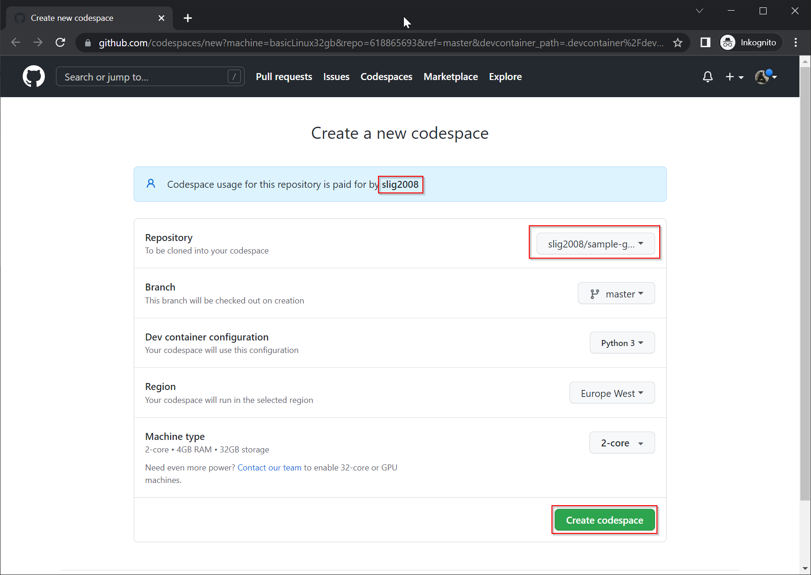
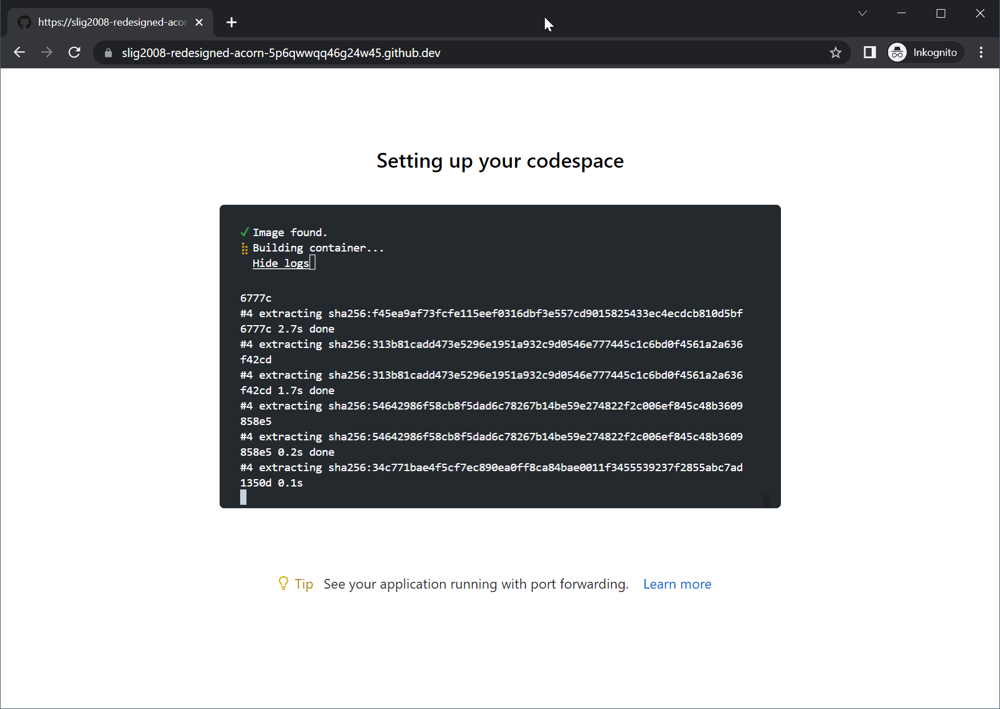
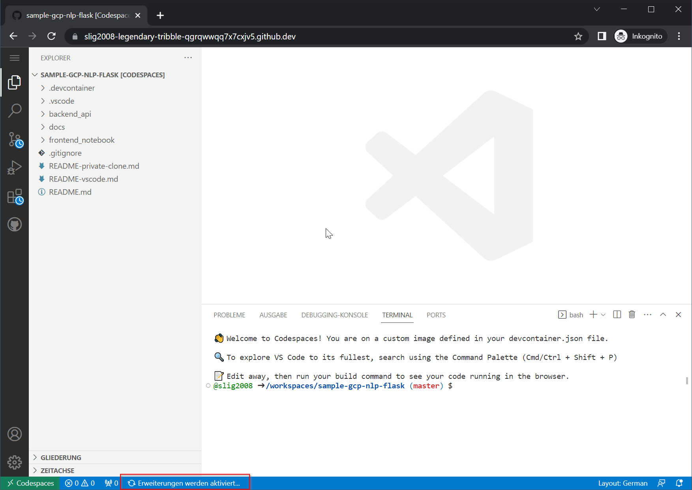
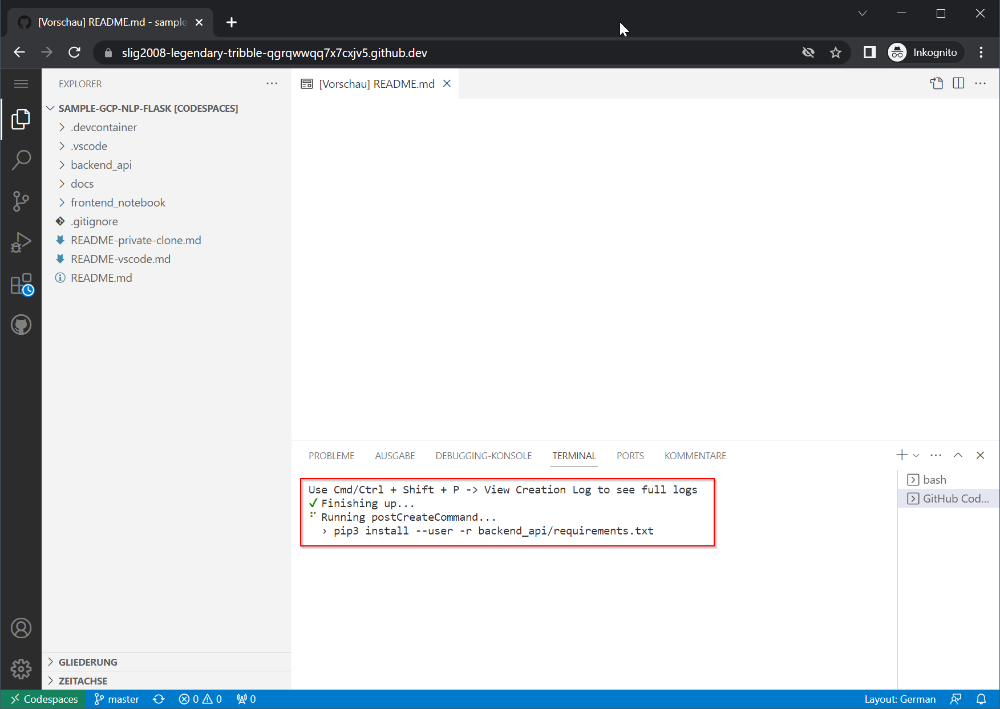
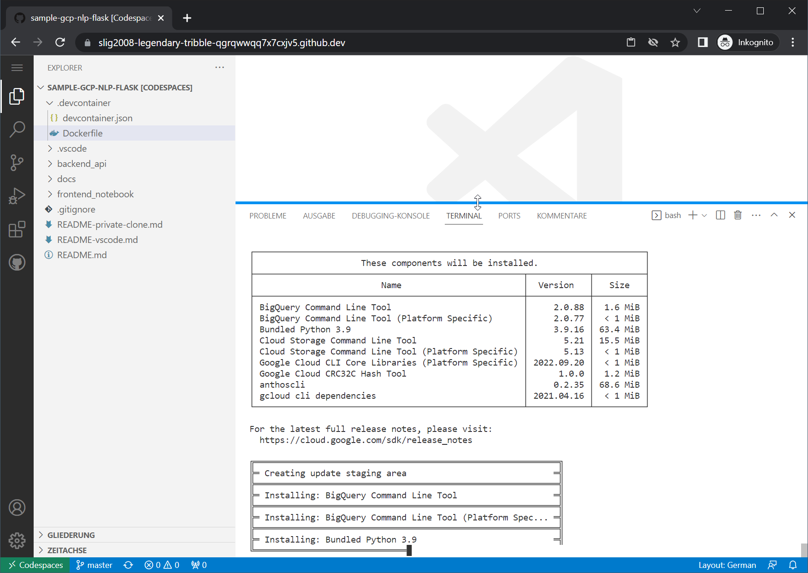
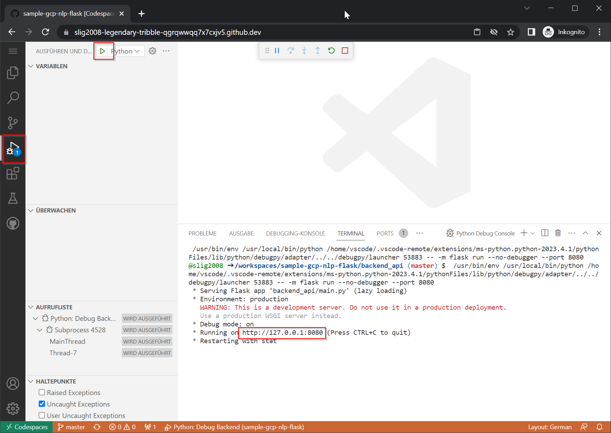
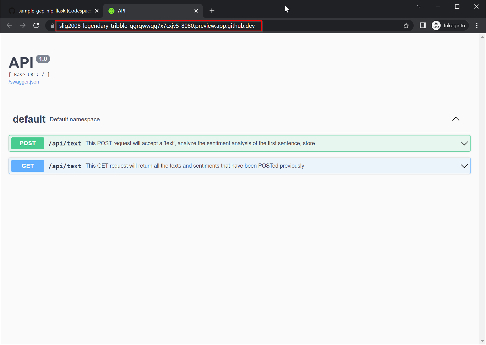
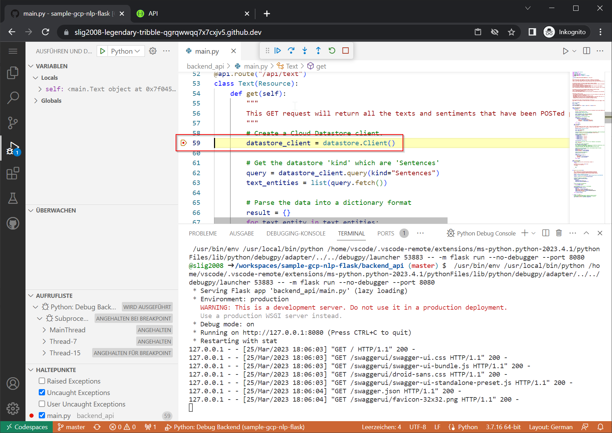

# Remote development with Github Codespaces
By using the DevContainer defintion that comes with this repository, you can also give Github Codespaces a try if you'd like. Those not familar can have a more detailed here: https://github.com/features/codespaces. This will allow you to do all your development work from within your Browser, or you can connect to the remote environment with JetBrains tools or VS Code.

## Prerequisites
It might very well be that you need to have a personal fork of your teams private repository available to your personal Github user. Be careful - as of today there only is 60 hours per month free to your Github account with a 2 core remote environment.

## Create your Codespace
Go to https://github.com/codespaces and click on "New codespace"

Make sure to double check the repository you'd like to work with as well as who is going to pay for this codespace. Ideally, this should be your personal account, so you'd use as much free capacity as available.

Now wait for the container to be built.

Please be patient once you see something like this, it is not yet finished.

Wait until the postcreate command has been execute successfully.

## Re-install Google Cloud SDK
Although this already is part of the container / Dockerfile definition, for me the Google Cloud SDK wasn't yet available. From within a Terminal, you need to run the following command.

    curl -sSL https://sdk.cloud.google.com > /tmp/install.sh && bash /tmp/install.sh --install-dir=/workspaces --disable-prompts

Wait until finished

## Initialize your codespace
You now need to [Authenticate your user](README-vscode.md#authenticate-your-user), [Initialize your project](README-vscode.md#initialize-your-project) and [Create an authentication key.json file for Service User](README-vscode.md#create-an-authentication-keyjson-file-for-service-user)

## Start debugging your backend
You are now enabled to start running/debugging your backend from your local machine. Click an "Run and Debug" and the left side menu, then click the play button next to "Python: Debug Backend". Click on the link shown in the Terminal output to open a new tab with the hosted Swagger UI.

A new tab will be opened, please be aware of the Uri which actually is not going to be http://127.0.0.1:8080 but a forward to your Codespace hosted session.

You are now ready to go to set breakpoints in the backend as you need.

## Using Jupyter notebooks from Github Codespace
You can also you Jupyter notebooks from your Codespace quite easily and the initialization process is very similar to what is to be done in Visual Studio Code. You can follow the [more detailed description here](README-vscode.md#jupyiter-notebooks-from-vs-code).