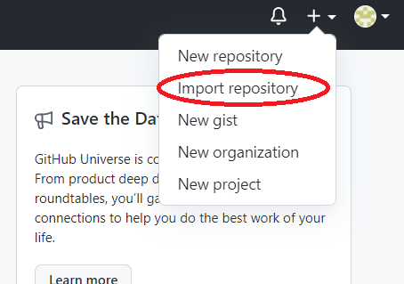
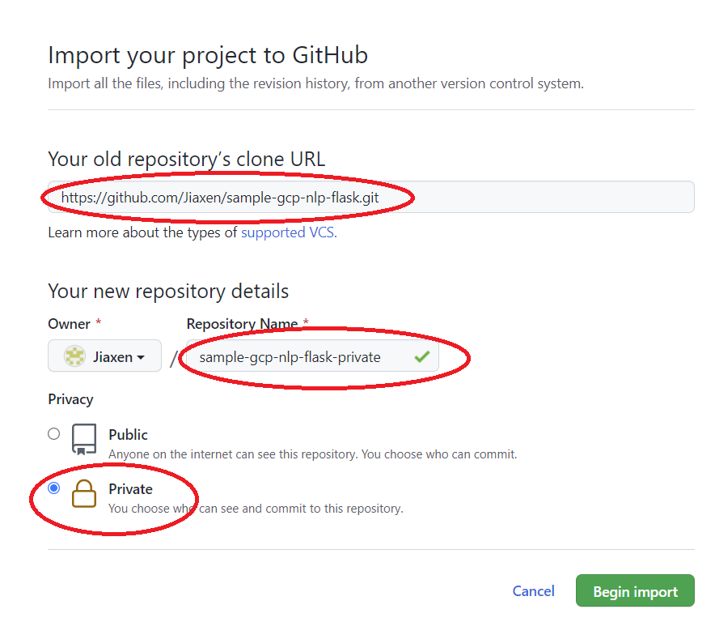

## Making a private repo clone on GitHub
If you wish to make a private clone of this repository, follow these steps:

1) Go to your GitHub, click + on the top right, and select 'Import Repository'. \
   
   
2) Paste in the clone url for this repo (https://github.com/Jiaxen/sample-gcp-nlp-flask.git), give your repository a name, and then select 'Private' for privacy. \
   
   
3) Click 'Begin Import'.

## Cloning your private repository 
After the above, when cloning your private repository (e.g. into Cloud Shell or your local machine), you will need to sign in to GitHub.

In case you haven't done this in a while, you may need to use a personal access token in place of your password: 
https://docs.github.com/en/github/authenticating-to-github/keeping-your-account-and-data-secure/creating-a-personal-access-token

Alternatively, Cloud Shell can help you log in with `gh auth login`.