# Development on local machine using VS Code & DevContainer
If you are not familiar with DevContainer yet, you can have a more detailed read here: https://containers.dev/ and here: https://code.visualstudio.com/docs/devcontainers/containers. Basically, this allows you to have all you development dependencies (such as Python Runtime, Google Cloud SDK, ...) in a container not polluting your machine at all. This enables any developer to just clone the repository and start working without running into too much hassle with local installations and non-matching versions of libraries or runtimes.

Although you can see a lot of screenshots below, this overall setup process shouldn't take more than 15 mins of your time - mostly waiting for the download of the base layer of your container and the dependencies to be installed.

As VS Code is available for all major platforms (Linux, Mac, Windows) the following should be working for you independently of your system. Please note it has only been tested on Mac as well as Windows.

## Prerequisites
- Visual Studio Code
- Docker Desktop
- Your teams private repository cloned to your machine

## Open Repository
Once you open the repository folder (File -> Open Folder) in VS Code, you'll be asked if you'd like to use / open this repository in a Container.
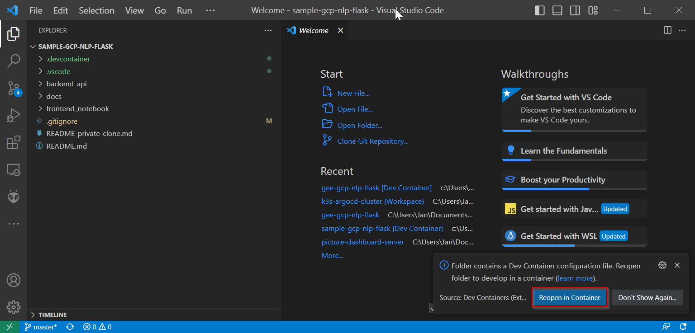

It might very well be you have said "Don't show again..." to the same in the past, however, you can still reopen the same in a Container by clicking on the green area on the bottom left side.
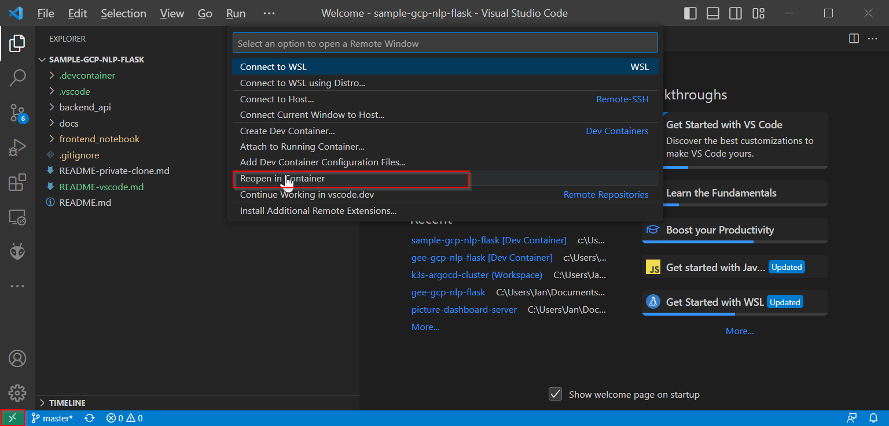

You should now see VS Code is opening / creating the Container in the backs. If you are interested in the overall progress, you can click on "Show log"
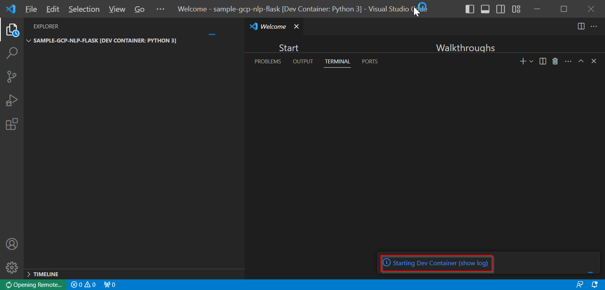

A terminal will be opened where you can follow the Container creation and setup process
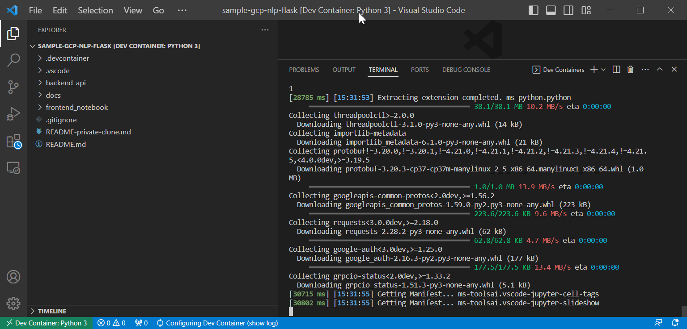

## Initialize Google Cloud SDK
After the container has been setup locally, you'd like to initialize the Google Cloud SDK so your backend actually is enable to talk to the GCP services. Please refer to the [backend readme](backend_api/README.md) for more details.

### Authenticate your user
Run the following command in a terminal in the container hosted session, follow the link and retrieve the token. Paste the Token copied.

    gcloud auth login

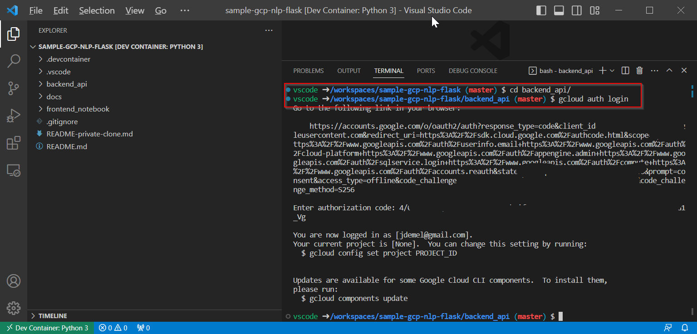

### Initialize your project
Run the following command in the same terminal as above and follow the wizard accordingly. Use your GEE case-study team's project.

    gcloud init

### Create an authentication key.json file for Service User
Run the following commands in the same terminal as above. Export you GCP's project id first.

    export PROJECT_ID=$(gcloud config get-value core/project)

Export the authentication key for the service account now.

    gcloud iam service-accounts keys create key.json --iam-account \
    ${PROJECT_ID}@appspot.gserviceaccount.com

<mark><b>This key.json file is to be kept secret. Make sure to never commit to your repository!</b></mark>

Congratulations, you now are ready to start playing around with the code!

## Debug your backend
You are now enabled to start running/debugging your backend from your local machine. Click an "Run and Debug" and the left side menu, then click the play button next to "Python: Debug Backend".
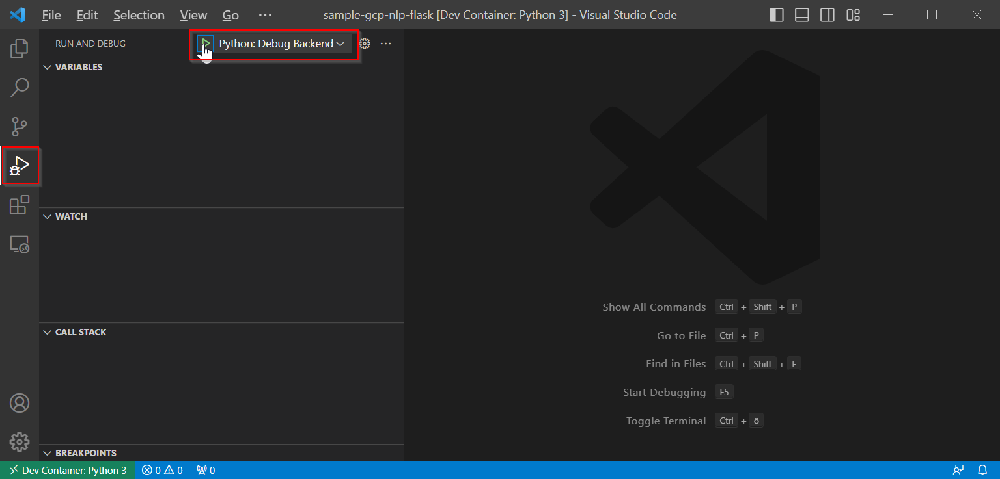

Once started, you can click on the button to open up the Swagger UI of your backend.
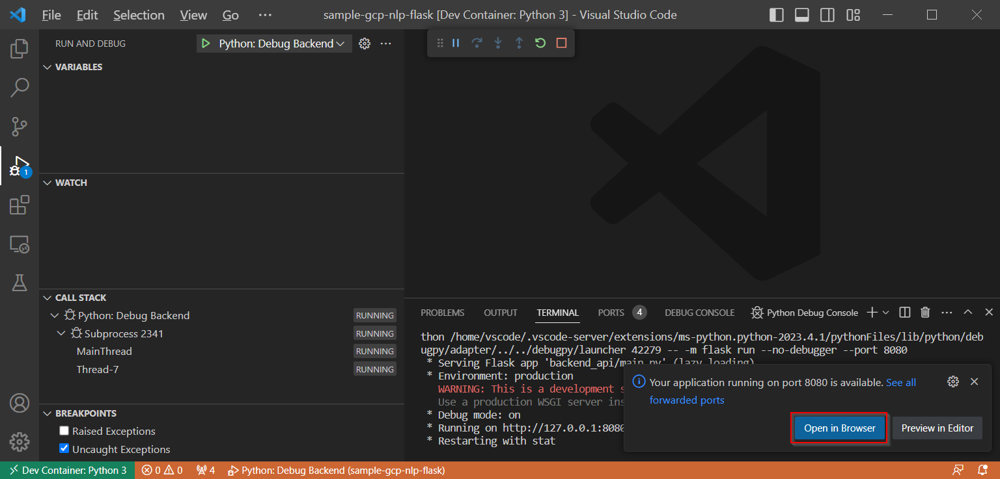

In your backend code, you can now set breakpoints as you need and trigger actions from the Browser.
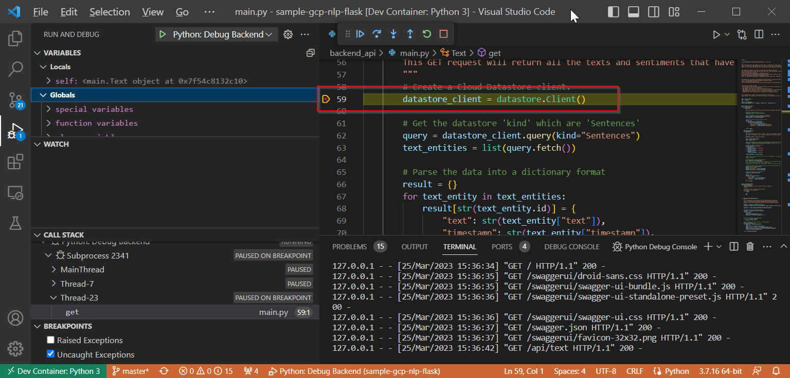

## Jupyiter notebooks from VS Code
You can easily play around with the Jupyter notebooks (the frontend part to the sample application) locally from within VS Code and you new container as well. You can read more about this in the [frontend readme](frontend_notebook/README.md). Some things need to be done to get you started.

### Install Kernel & dependencies
Open the [Plotly_Data_Visualization_Demo.ipynb](frontend_notebook/Plotly_Data_Visualization_Demo.ipynb) notebook and scroll to the first cell (Python code). This will install all dependencies this notebook needs. Click on the play button next to the cell for execution.
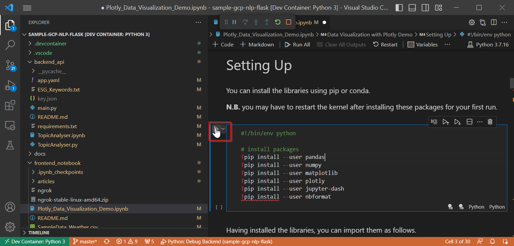

You'll be asked if you'd like to install the Kernel that enables you to run this notebook. Click on "Install".
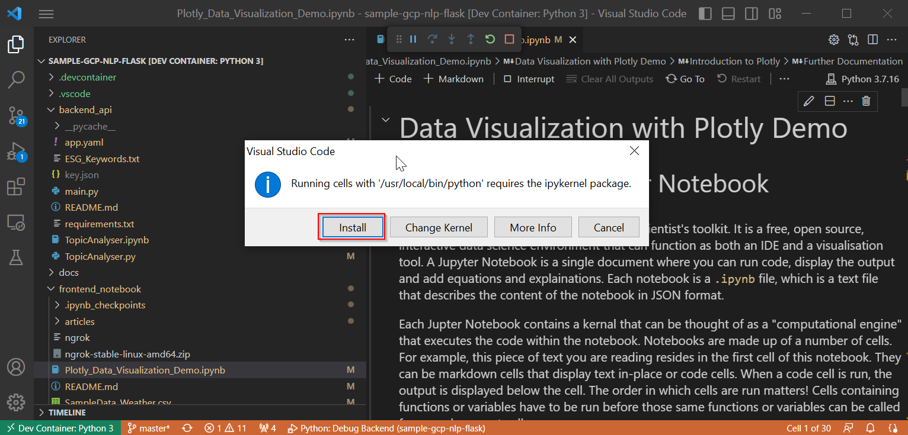

### Restart Kernel
Once the Kernel has been installed and the cell that installs the dependencies has been run successfully, restart the Kernel (so the dependencies just installed will become available).
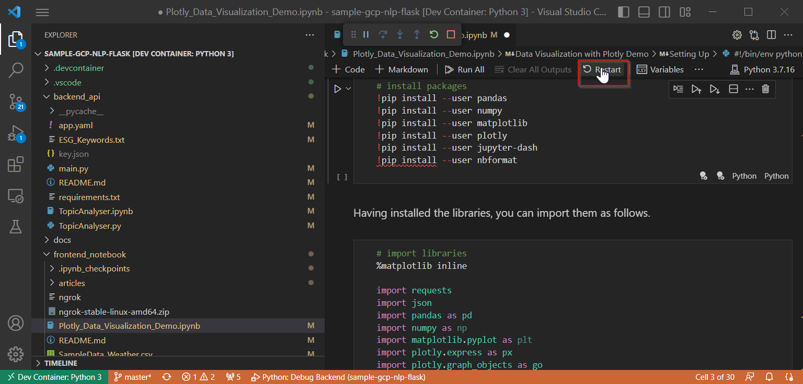

Congratulations, you now are ready to go and can execute the Jupyter notebook cells as you like.
