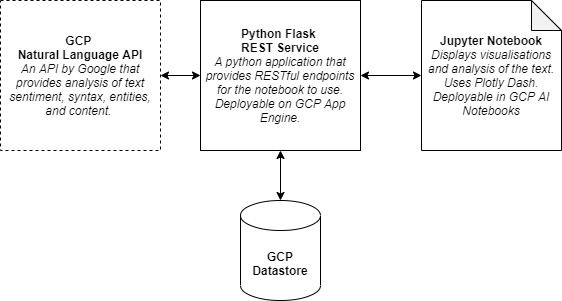

# Sample GCP Flask App using Cloud Natural Language API

Welcome! This is the stub project for building your Natural Language Analysis Platform using GCP.

## Team Setup
1) One person in your team should create a private GitHub clone of this repository. See [here](README-private-clone.md) for instructions to make a private clone of this repository.
2) The same person should add your team members' GitHub accounts into the private GitHub clone that you have made.
3) This repo can then be used by your team to do the development.

## The Goal
The goal is to set up a platform to analyse text data using GCP Services.

## The Architecture

### The backend
The backend is a REST endpoint service using the Flask framework in Python. This will be deployed in GCP App Engine.
This component will talk to GCP's [Natural Language API](https://cloud.google.com/natural-language) service to analyse 
our text, and use GCP Datastore as a NoSQL database for storage. 

The code for the backend is in the **/backend_api** folder.

### The frontend
The frontend is a Jupyter notebook which interacts with the backend REST service to obtain the analysed data, and then
creates visualisations. 

The code for the frontend is in the **/frontend_notebook** folder, as well as some coded examples of visualisation.
 
## Get started
Get started by reading the readme in the /backend_api folder. 